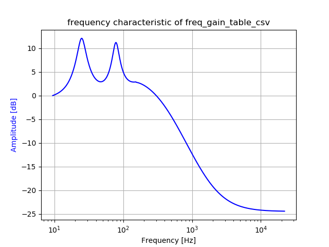
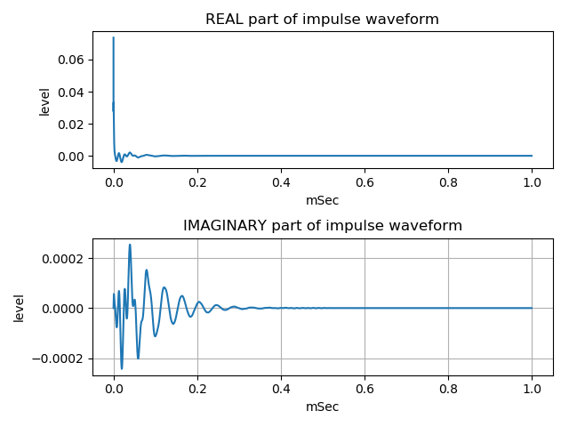
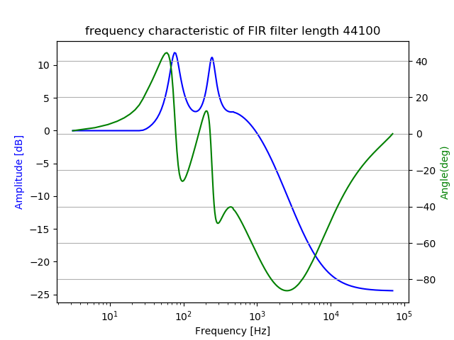
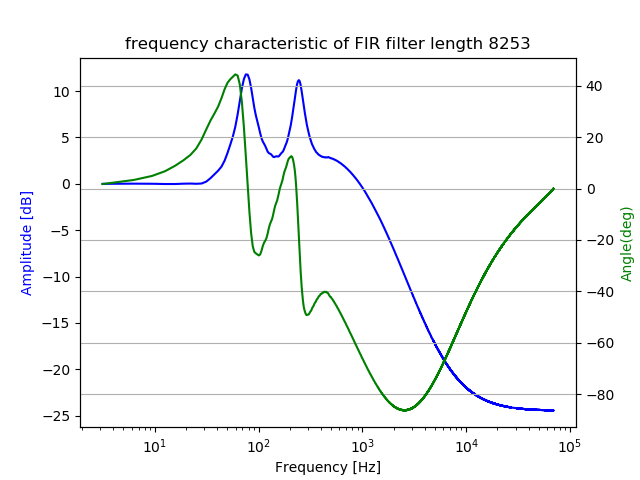

# minimum-phase FIR filter design  
  
An approximate minimum-phase FIR filter design from specified frequency characteristic by use Hilbert transform.  
  
[github repository](https://github.com/shun60s/Python-minimum-phase-FIR-design/)  
  
  
## usage  
  
python FIR-design1.py  
draw frequency phase characteristic of approximate minimum-phase FIR filter from the frequency characteristic, freq_gain_table.csv.  
save FIR filter coefficient to a text file.  

## output sample  

frequency characteristic of freq_gain_table_csv  
  

frequency phase characteristic with approximate minimum phase by use Hilbert transform  
  

impulse waveform  
  
  
  
frequency phase characteristic of FIR length 44100 by use scipy.signal.freqz  
  
  
  
frequency phase characteristic of FIR length 8253 by use scipy.signal.freqz  
  
  
  
These figures are in the docs folder.  

## requirements package  
  
python3  
Please see  Check version in FIR-design1.py.  

## License  
MIT  
